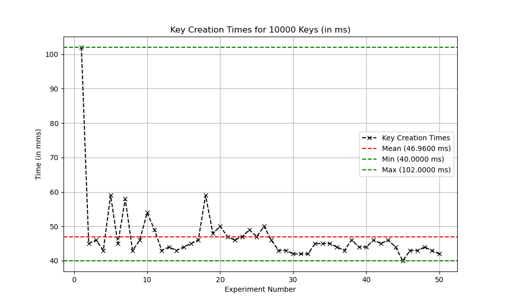
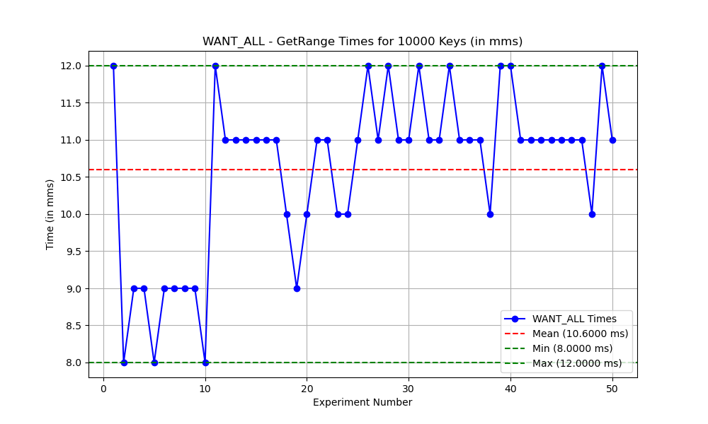
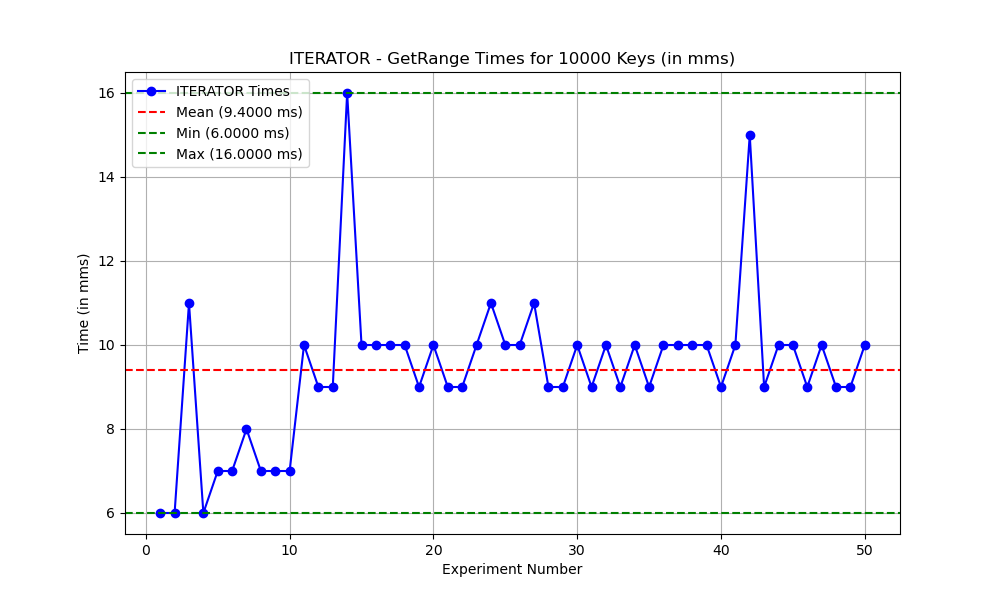
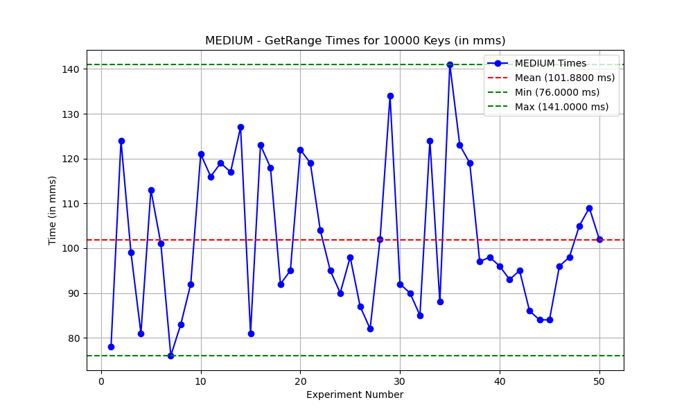
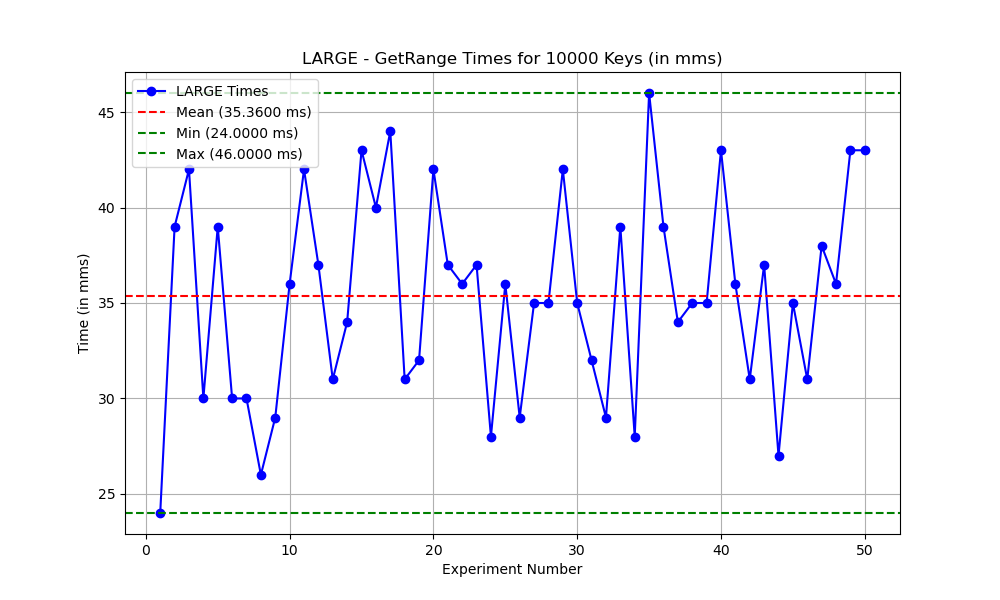

# Explore FoundationDB and its Java Client Library

## Install and setup FoundationDB server (version 6.2.30) up and running:

- I downloaded the appropriate package for my OS from the official FoundationDB downloads page: [FoundationDB Downloads](https://apple.github.io/foundationdb/downloads.html).
- I used GitHub Collab to run this project, I chose the Linux/Ubuntu version and downloaded it with the following commands:
    ```bash
  wget https://github.com/apple/foundationdb/releases/download/6.3.23/foundationdb-clients_6.3.23-1_amd64.deb
  wget https://github.com/apple/foundationdb/releases/download/6.3.23/foundationdb-server_6.3.23-1_amd64.deb
  ```
- I installed both the server and client packages using the dpkg command:
    ```bash
    sudo dpkg -i foundationdb-clients_6.3.23-1_amd64.deb
    sudo dpkg -i foundationdb-server_6.3.23-1_amd64.deb
    ```
- To ensure that the installation was successful, I ran the fdbcli command and checked the status in the FoundationDB terminal.
    ```bash
    fdbcli
    status
    ```
- **Accomplishment**: I successfully installed and set up the FoundationDB server (version 6.2.30) and its client on an Ubuntu system.
- **SubTask Completion**: This task was completely, and FoundationDB server and client were installed without any issues, and the server was verified to be running correctly.
- **Obstacles**: There were no obstacles encountered during the installation and setup process.

## Install Java 8, Maven, and IntelliJ:

- **Accomplishment**: I already had Java 8, and Maven installed in my MacOS, I just downloaded and installed IntelliJ from Internet.
- **SubTask Completion**: This task was completely by installing Java 8, Maven, and IntelliJ.
- **Obstacles**: There were no obstacles encountered during the installation process.

## Use the FDB command line tool (fdbcli) to connect to the cluster. Try to use its commands set,get, getrange and explore other commands (via command help in fdbcli)

- First I opened FDB command line tool using fdbcli.
- I tried out few of the below commands:
    ```bash
    writemode on 
    set k1 v1
    set k2 v2
    set k3 v3
    writemode off
    get k1
    getrange k1 k4 5
    writemode on
    clear k3
    clearrange k1 k3
    begin
    set k1 v1
    set k2 v2
    commit
    getversion
    begin
    set k3 v4
    reset
    set k3 v3
    commit
    begin
    set k4 v4
    rollback
    exit
    ```
- **Accomplishment**: I successfully used the FDB command line tool (fdbcli) to connect to the FoundationDB cluster and tested various commands like writemode on, set, get, getrange, clear, clearrange, begin, commit, rollback, and exit within fdbcli.
- **SubTask Completion**: This task was completely by trying out various commands in fdbcli.
- **Obstacles**: There were no obstacles encountered during this process.

## Initialize a Java Maven project and create an executable program that could do basic get, set, getrange operations to the FDB server
```
- Create a class BasicFDBOps.java and use it for this sub-task
- Please use this dependency for the FDB Java client: https://mvnrepository.com/artifact/org.foundationdb/fdb-java/6.2.22
- For each operation, create a separate Java method for it
```
- Created a Java Maven project and implemented basic operations (get, set, getRange, clear, clearRange).
- Installed the Java extension in GitHub Colab and used mvn clean compile to generate class files.
- Ran the Java files using the Run/Debug option in Visual Studio Codespace setup.
- **Accomplishment**: Successfully created a Java Maven project to interact with FoundationDB. The project implements basic operations like inserting, retrieving, and querying a range of keys in the database, using the FoundationDB Java client.
- **SubTask Completion**: The sub-task was fully completed. All required operations, including get, set, and getRange, were implemented as separate methods. In addition, other important methods such as clear and clearRange were also implemented for managing key-value pairs in the database
- **Obstacles**:
    - The program requires a properly installed and running instance of FoundationDB to function correctly. Without an active FDB server, the operations will not execute as expected.
    - For asynchronous handling, the getRange function required the proper use of CompletableFuture to handle results asynchronously.

## Measure single getrange performance:
```
- Create a class SingleGetRange.java and use it for this sub-task
- Store 10k key-value pairs (key_i, val_i) in FDB
- Retrieve all 10k key-value pairs by executing a getrange on \x00 \xff
- Modify getrange to use different modes (WANT_ALL, EXACT, ITERATOR, etc..) and report the response time of each execution
```
- For this task, I create 10k Key-Value pairs and stored it in FDB and retrieved it through different streaming modes, and deleted all the keys, and repeated the same experiment for a total of 10 times.
- Below are the results of the same :









- **Observations**:
    - The time to create 10,000 keys varies significantly across the experiments, ranging from about 54 to 91 seconds. This variation could be due to factors such as system load, network latency, or other environmental conditions during each test run.
    - GetRange Performance:
        - WANT_ALL and ITERATOR modes consistently show the best performance, with ITERATOR often being slightly faster.
        - EXACT mode also performs well but is slightly slower than ITERATOR.
        - SMALL mode has the slowest performance among all modes, likely due to the overhead of managing multiple smaller batches of data. This mode is more suitable for scenarios where system memory usage needs to be minimized.
        - MEDIUM and LARGE modes provide a middle ground between performance and memory usage, with LARGE performing slightly better than MEDIUM. These modes are useful when a balance between batch size and transfer efficiency is required.
        - SERIAL mode performs reasonably well, indicating its effectiveness in transferring data in a serial manner while maintaining low latency.
        - The performance differences between these modes can be attributed to how FoundationDB handles data batching and transfer internally.
- **Accomplishment**: Successfully created a Java Maven project to interact with FoundationDB, and retrieve 10k Key-Value pairs using different streaming modes, and understanding the performance of each streaming mode.
- **SubTask Completion**: The sub-task was fully completed.
- **Obstacles**:
    - I had few issues while fetching using \x00 \xff, which I solved but going through the documentation and some use of Chatgpt to understand.