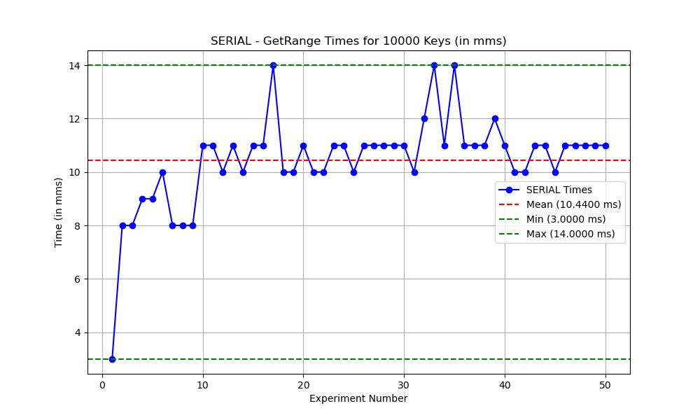
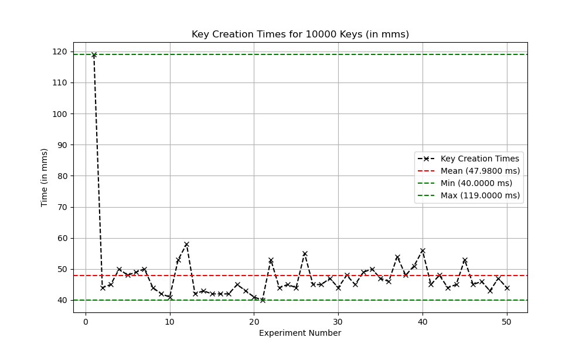
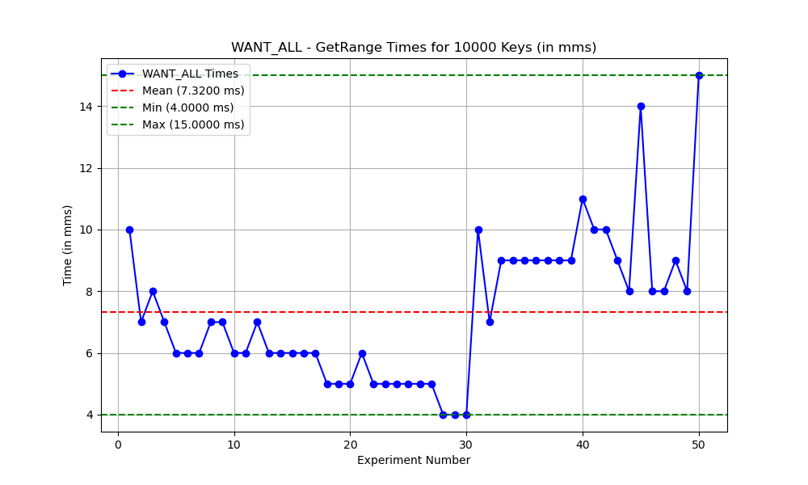
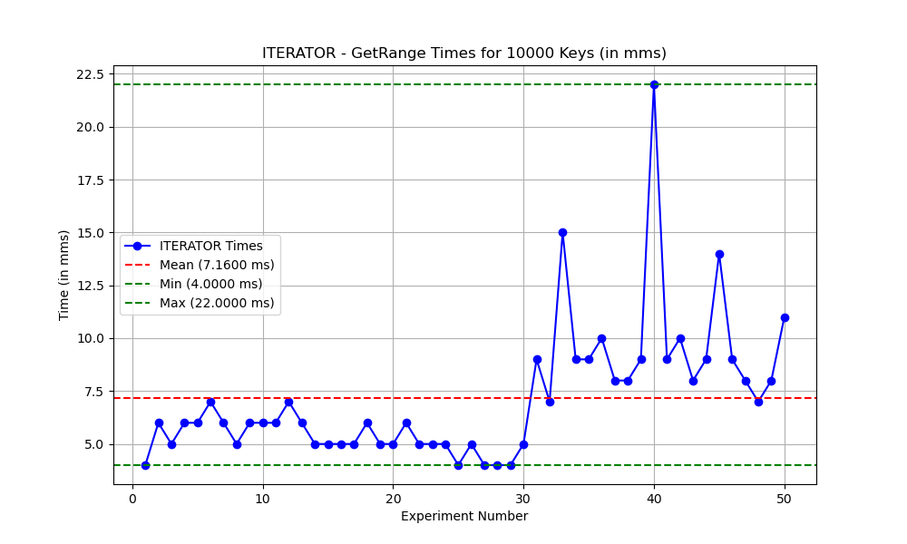
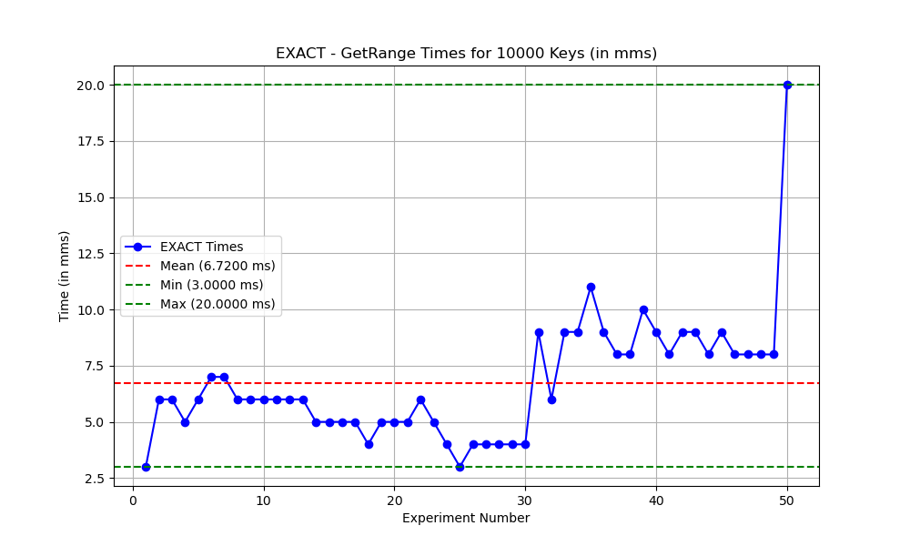
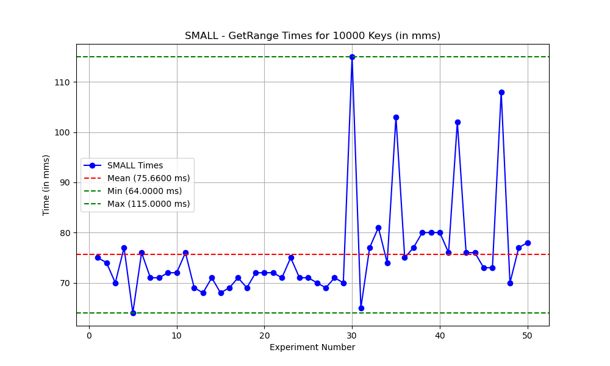
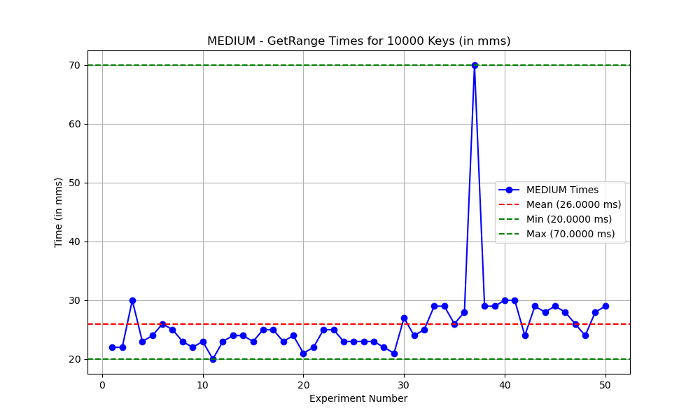
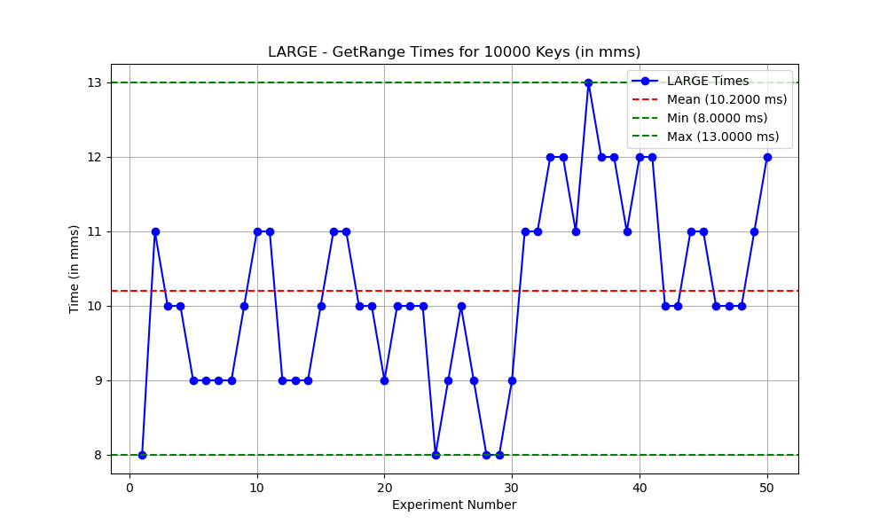
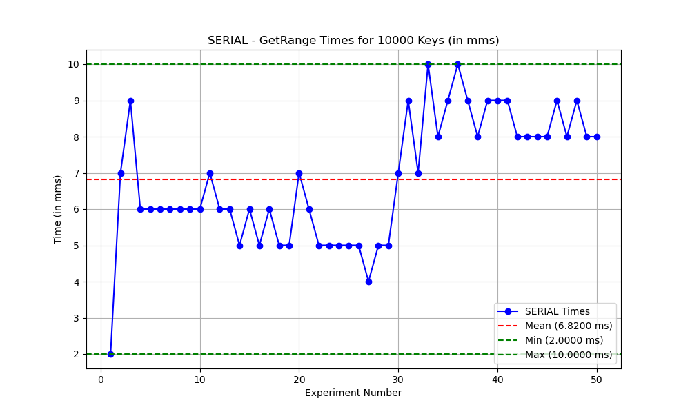

# Explore FoundationDB and its Java Client Library

## Install and setup FoundationDB server (version 6.2.30) up and running:

- I downloaded the appropriate package for my OS from the official FoundationDB downloads page: [FoundationDB Downloads](https://apple.github.io/foundationdb/downloads.html).
- I used GitHub Collab to run this project, I chose the Linux/Ubuntu version and downloaded it with the following commands:
    ```bash
  wget https://github.com/apple/foundationdb/releases/download/6.3.23/foundationdb-clients_6.3.23-1_amd64.deb
  wget https://github.com/apple/foundationdb/releases/download/6.3.23/foundationdb-server_6.3.23-1_amd64.deb
  ```
- I installed both the server and client packages using the dpkg command:
    ```bash
    sudo dpkg -i foundationdb-clients_6.3.23-1_amd64.deb
    sudo dpkg -i foundationdb-server_6.3.23-1_amd64.deb
    ```
- To ensure that the installation was successful, I ran the fdbcli command and checked the status in the FoundationDB terminal.
    ```bash
    fdbcli
    status
    ```
- **Accomplishment**: I successfully installed and set up the FoundationDB server (version 6.2.30) and its client on an Ubuntu system.
- **SubTask Completion**: This task was completely, and FoundationDB server and client were installed without any issues, and the server was verified to be running correctly.
- **Obstacles**: There were no obstacles encountered during the installation and setup process.

## Install Java 8, Maven, and IntelliJ:

- **Accomplishment**: I already had Java 8, and Maven installed in my MacOS, I just downloaded and installed IntelliJ from Internet.
- **SubTask Completion**: This task was completely by installing Java 8, Maven, and IntelliJ.
- **Obstacles**: There were no obstacles encountered during the installation process.

## Use the FDB command line tool (fdbcli) to connect to the cluster. Try to use its commands set,get, getrange and explore other commands (via command help in fdbcli)

- First I opened FDB command line tool using fdbcli.
- I tried out few of the below commands:
    ```bash
    writemode on 
    set k1 v1
    set k2 v2
    set k3 v3
    writemode off
    get k1
    getrange k1 k4 5
    writemode on
    clear k3
    clearrange k1 k3
    begin
    set k1 v1
    set k2 v2
    commit
    getversion
    begin
    set k3 v4
    reset
    set k3 v3
    commit
    begin
    set k4 v4
    rollback
    exit
    ```
- **Accomplishment**: I successfully used the FDB command line tool (fdbcli) to connect to the FoundationDB cluster and tested various commands like writemode on, set, get, getrange, clear, clearrange, begin, commit, rollback, and exit within fdbcli.
- **SubTask Completion**: This task was completely by trying out various commands in fdbcli.
- **Obstacles**: There were no obstacles encountered during this process.

## Initialize a Java Maven project and create an executable program that could do basic get, set, getrange operations to the FDB server
```
- Create a class BasicFDBOps.java and use it for this sub-task
- Please use this dependency for the FDB Java client: https://mvnrepository.com/artifact/org.foundationdb/fdb-java/6.2.22
- For each operation, create a separate Java method for it
```
- Created a Java Maven project and implemented basic operations (get, set, getRange, clear, clearRange).
- Installed the Java extension in GitHub Colab and used mvn clean compile to generate class files.
- Ran the Java files using the Run/Debug option in Visual Studio Codespace setup.
- **Accomplishment**: Successfully created a Java Maven project to interact with FoundationDB. The project implements basic operations like inserting, retrieving, and querying a range of keys in the database, using the FoundationDB Java client.
- **SubTask Completion**: The sub-task was fully completed. All required operations, including get, set, and getRange, were implemented as separate methods. In addition, other important methods such as clear and clearRange were also implemented for managing key-value pairs in the database
- **Obstacles**:
    - The program requires a properly installed and running instance of FoundationDB to function correctly. Without an active FDB server, the operations will not execute as expected.
    - For asynchronous handling, the getRange function required the proper use of CompletableFuture to handle results asynchronously.

## Measure single getrange performance:
```
- Create a class SingleGetRange.java and use it for this sub-task
- Store 10k key-value pairs (key_i, val_i) in FDB
- Retrieve all 10k key-value pairs by executing a getrange on \x00 \xff
- Modify getrange to use different modes (WANT_ALL, EXACT, ITERATOR, etc..) and report the response time of each execution
```
- For this task, I create 10k Key-Value pairs and stored it in FDB and retrieved it through different streaming modes, and deleted all the keys, and repeated the same experiment for a total of 50 times.
- Below are the results of the same :




- **Observations**:
    - The time to create 10,000 keys varies significantly across the experiments, ranging from about 10.8 to 12 seconds. 
    - GetRange Performance:
        - EXACT, ITERATOR, WANT_ALL modes consistently show the similar better performance if we neglect the outlier experiments.
        - SMALL, MEDIUM, LARGE, SERIAL does batches in fetching with 256,1000,4096,80000 bytes, according to implementation. Their results also would be in the same, in our case since k,v size is more than 80k bytes, so Latency of SMALL>MEDIUM>LARGE>SERIAL
        - Byte Limit:
            - /* _ITERATOR mode maps to one of the known streaming modes
   depending on iteration */
            - const int mode_bytes_array[] = { GetRangeLimits::BYTE_LIMIT_UNLIMITED, 256, 1000, 4096, 80000 };
            - /* The progression used for FDB_STREAMING_MODE_ITERATOR.
   Goes 1.5 * previous. */
            - static const int iteration_progression[] = { 4096, 6144, 9216, 13824, 20736, 31104, 46656, 69984, 80000, 120000 };

- **Accomplishment**: Successfully created a Java Maven project to interact with FoundationDB, and retrieve 10k Key-Value pairs using different streaming modes, and understanding the performance of each streaming mode.
- **SubTask Completion**: The sub-task was fully completed.
- **Obstacles**:
    - I had few issues while fetching using \x00 \xff, which I solved but going through the documentation and some use of Chatgpt to understand.

## Compare single getrange vs multiple getranges sent in parallel:
```
- Create a class SingleVsMultiRanges.java and use it for this sub-task
- With the 10k key-value pairs stored in sub-task 5, define 10 ranges R1, R2, ..., R10 such
that executing getrange on each of those 10 ranges returns exactly 1k key-value pairs.
- Execute getRange() requests on these 10 ranges in parallel
- Repeat the execution with different streaming modes (WANT_ALL, EXACT, ITORATOR, etc..) and report the response time of each execution. How are the numbers compared with the case in sub-task 5 where we only issue one getrange on \x00 \xff ?
```
- I created 10k Key-Value pair in Fdb like key_i value_i.
- Divide the 10k into 10 equal ranges and call getrange in parallel 10 times, and wait for all the results to be populated, and do this in different streaming modes.
- Repeat the whole experiment 50 times, and note timings for each iteration.
- **Observation**:
    - Below are the observation for the 50 experiments:










- **Table** in ms:

    |              | SingleGetRange | SingleVsMultiRanges |
    |--------------|----------------|---------------------|
    | Key Creation | 23988          | 25591               |
    | WANT_ALL     | 7.7800         | 6.4000              |
    | ITERATOR     | 7.9800         | 5.7600              |
    | EXACT        | 7.8800         | 5.7000              |
    | SMALL        | 332.10         | 72.400              |
    | MEDIUM       | 93.380         | 23.240              |
    | LARGE        | 30.120         | 10.980              |
    | SERIAL       | 7.6000         | 6.3000              |

- **Inference**:
    - SMALL, MEDIUM, LARGE streaming modes involve retrieving data in batches. By splitting the data into smaller ranges and issuing multiple parallel requests, each request can operate on a smaller portion of the dataset. This reduces the time needed for each request, as parallelism can be leveraged effectively, resulting in better performance compared to issuing a single large request.
    
- **Accomplishment**: Successfully created a Java Maven project to interact with FoundationDB, and retrieve 10k Key-Value pairs using different streaming modes parallely, and compare with previous task.
- **SubTask Completion**: The sub-task was fully completed.
- **Obstacles**:
    - I had few issues while comparing the time, and understanding the results.
    - I was having difficulty in understanding how exactly each streaming mode works, I couldn't find elaborate documentation on the same except [this](https://www.javadoc.io/doc/org.foundationdb/fdb-java/7.1.2/com/apple/foundationdb/StreamingMode.html)

## Understand read snapshot:
```
- Create a class ReadSnapshot.java and use it for this sub-task
- Store any arbitrary 4 key-value pairs in the database. Denote the keys as K1, K2, K3 and
K4
- Start a transaction T1 and read several keys (let's say K1, K2, K3)
- On another thread, start a transaction T4 that updates the values of K2, K4
- Commit transaction T1. Would T1 be aborted? Explain why.
- Commit transaction T2. Would T2 be aborted? Explain why.
```
- **Analysis**:
    - Commit transaction T1. Would T1 be aborted? Explain why.
        - Read Snapshot: When T1 reads K1, K2, and K3, it takes a snapshot of the database at that point in time. This means that T1 is working with consistent data that will not be affected by other transactions (such as T4) until T1 commits.
        - When T4 updates K2 and K4, it modifies the database. However, T1 has already taken a snapshot of the data, so T1 sees the values of K2 and K4 at the time T1 started, and the changes made by T4 are not visible to T1.
        - T1 will not be aborted because it sees the snapshot data from the time it started, and the changes in T4 do not conflict with T1’s operations (since T1 is reading old values of K2 and K4). It can commit successfully without any issues. The changes made by T4 will only be visible to future transactions.
    - Commit transaction T4. Would T4 be aborted? Explain why.
        - T4 updates K2 and K4, but it does not conflict with any ongoing transaction because it is writing to K2 and K4, due to 5s MVCC, so T1 would read take the old snapshot.
        - T4 can commit successfully, as its updates will not interfere with T1’s snapshot. The transaction T4 will update the database, and its changes will be visible to future transactions, but not to T1, since T1 has already taken a snapshot of the data.

- **Accomplishment**: Successfully created a Java Maven project to interact with FoundationDB, and understand Read Snapshot and few basic transactions.
- **SubTask Completion**: The sub-task was fully completed.
- **Obstacles**: There were no obstacles.

## Understand transaction conflict:
```
- Create a class TransactionConflict.java and use it for this sub-task
- Store any arbitrary 2 key-value pairs in the database. Denote the keys as K1 and K2.
- Start a transaction T1 to read K1 and update the value of K2
- Start a transaction T2 to read K2 and update the value of K1
- Commit T2. Would T2 be aborted? Explain why.
- Commit T1. Would T1 be aborted? Explain why.
```
- When T1 reads K1, it sees the initial values ("Value1"). However, before T1 commits, T2 reads K2 ("Value2") and updates K1 to "UpdatedByT2". T2 successfully commits because there are no conflicts at that point.
- When T1 tries to commit, FoundationDB detects that T1 uses old data and is trying to update K2 based on that stale information. Since T2 has already committed and modified K1, committing T1 would lead to an inconsistent state. Therefore, FoundationDB aborts T1 to maintain data integrity and consistency.
- To resolve this conflict, T1 would need to retry its transaction, starting from the beginning, to ensure it has the latest data before making any modifications.
- In summary, T2 commits successfully, while T1 is aborted due to a transaction conflict caused by reading stale data and attempting to modify a key that has been updated by another transaction.
- **Accomplishment**: Successfully created a Java Maven project to interact with FoundationDB, and understand Transaction conflicts.
- **SubTask Completion**: The sub-task was fully completed.
- **Obstacles**: There were no obstacles.