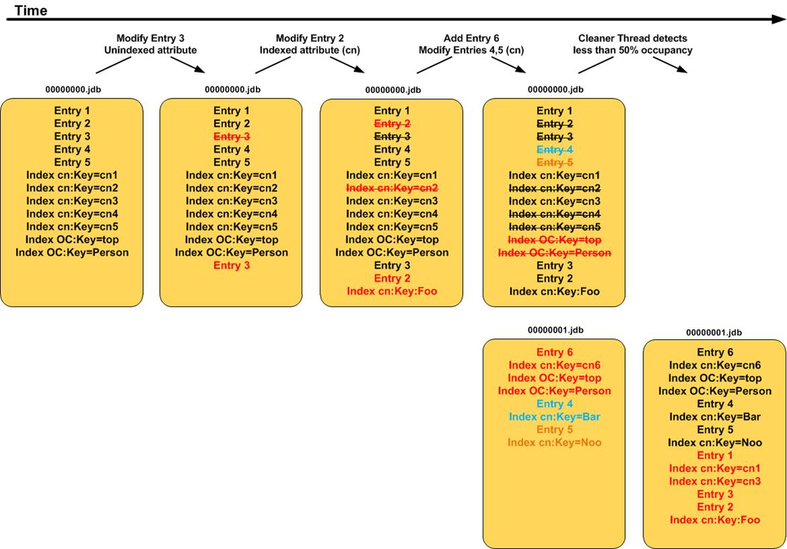

# Explore JanusGraph and its Storage Plugins
## Install Java 8, Maven and IntelliJ

- **Accomplishment**: I already had Java 8, and Maven installed in my MacOS, I just downloaded and installed IntelliJ from Internet.
- **SubTask Completion**: This task was completely by installing Java 8, Maven, and IntelliJ.
- **Obstacles**: There were no obstacles encountered during the installation process.

## Create a new Maven project (called SampleGraphApp) and develop a simple application with JanusGraph

```
a. Use janusgraph-core dependency:
https://mvnrepository.com/artifact/org.janusgraph/janusgraph-core/1.0.0-20231021-
144322.55d7454
b. Use janusgraph-inmemory dependency so the graph created is stored in the application
memory:
https://mvnrepository.com/artifact/org.janusgraph/janusgraph-inmemory/1.0.0-20231021-
144322.55d7454
c. Write code to initialize the schema for Air Routes (see the note below)
d. Load the graph with some airroutes data. The data set could be found here:
https://github.com/krlawrence/graph/blob/master/sample-data/air-routes-latest-nodes.csv
https://github.com/krlawrence/graph/blob/master/sample-data/air-routes-latest-edges.csv
```

- Initialized Schema, and loaded edges and vertices from csv files provided.
- There were 3748 vertex and 57645 edges when I used CSVReader to load.
- Additional for understanding purpose, I played around with traversal of graph.

- **Accomplishment**: Create a simple Janusgraph with inmemory to store graph which is loaded with air-routes data.
- **SubTask Completion**: This task was completely by creating java program.
- **Obstacles**: There were no obstacles encountered during the installation process.

## Switch to use BerkeleyDB storage backend and load the whole graph:
```
a. Use janusgraph-berkeyleyje dependency:
https://mvnrepository.com/artifact/org.janusgraph/janusgraph-berkeleyje/1.0.0-
20231021-144322.55d7454
b. Load the whole airroutes data.
c. Report the number of vertices/edges loaded, the time it takes to load and the storage size
```
- Initialized Schema, and loaded edges and vertices from csv files provided.
- There were 3748 vertex and 57645 edges when I used CSVReader to load.
- I understand for persistent usage I have to commit at the end before closing the graph.
- Here are the below results:
    ```
    Output:
    Time taken to load to berkley db in ns is   : 11954347867
    Vertex count: 3748
    Edge count: 57645
    File: data/graph/je.lck 0 MB
    File: data/graph/je.stat.csv 0 MB
    File: data/graph/00000001.jdb 9 MB
    File: data/graph/00000002.jdb 1 MB
    File: data/graph/00000000.jdb 9 MB
    File: data/graph/je.config.csv 0 MB
    File: data/graph/je.info.0 0 MB
    Storage size: 20 MB
    Reloaded graph Details:
    Vertex count: 3748
    Edge count: 57645
    ```
- Storage size was calculated using java function which goes through all the files of the given storage.directory in my code, for which I got these results.
- Additionally, when I used du -sh command on that directory I am getting different result:
    ```
    du -sh data/graph/
    13M     data/graph/

    ls -l data/graph/
    total 12888
    -rw-r--r-- 1 vishal vishal 9997935 Jan 13 19:06 00000001.jdb
    -rw-r--r-- 1 vishal vishal 3172603 Jan 13 19:06 00000002.jdb
    -rw-r--r-- 1 vishal vishal    7597 Jan 13 19:06 je.config.csv
    -rw-r--r-- 1 vishal vishal    2801 Jan 13 19:06 je.info.0
    -rw-r--r-- 1 vishal vishal       0 Jan 13 19:06 je.lck
    -rw-r--r-- 1 vishal vishal    9264 Jan 13 19:06 je.stat.csv
    ```
- When I looked into it on why data/graph/00000000.jdb is being deleted, I got this (page)[https://www.identityfusion.com/blog/unlocking-the-mystery-behind-the-opendj-user-database#:~:text=Note%3A%20Initial%20log%20files%20are,file%20is%20created%20as%2000000001]
- It describes that : Over time records are deleted or modified in the log.  OpenDJ performs periodic cleanup of log files and rewrites them to new log files.  This task is performed without action by a system administrator and ensures consistency of the data contained in the log files.
- Initially, in our usecase vertex are added, then edges are added due to why maybe all the vertex are being called again which makes 00000000.jdb file to get deleted by cleanup.
- Image for better understanding:


## Switch to use foundationdb storage backend (see the .tar.gz file attached):
```
a. Install FoundationDB (version 6.2.30) and set it up and running
b. Unzip the tar file and open it in IntelliJ as a maven project
c. Build and install it locally
d. Use its dependency in your SampleGraphApp
e. Load the whole airroutes graph.
f. Similarly, report the number of vertices/edges loaded, the time it takes to load and the
storage size
```

- Initialized Schema, and loaded edges and vertices from csv files provided.
- There were 3748 vertex and 57645 edges when I used CSVReader to load.
- I understand for persistent usage I have to commit at the end before closing the graph, but due to limitation in FDB, I had to commit it thrice in my application, which causes increase in loading time.
- According to official documentation:
    ```
    FoundationDB currently does not support transactions running for over five seconds. In particular, after 5 seconds from the first read in a transaction:

    subsequent reads that go to the database will usually raise a transaction_too_old error (although reads cached by the client will not);

    a commit with any write will raise a transaction_too_old or not_committed error.
    ```

- Here are the below results:
    ```
    Output:
    Time taken to load to FDB db in ns is: 19599680366
    Vertex count: 3748
    Edge count: 57645
    Reloaded graph Details:
    Vertex count: 3748
    Edge count: 57645
    ```
    ```
    fdbcli
    status details

    Data:
    Replication health     - Healthy
    Moving data            - 0.000 GB
    Sum of key-value sizes - 6 MB
    Disk space used        - 140 MB
    ```